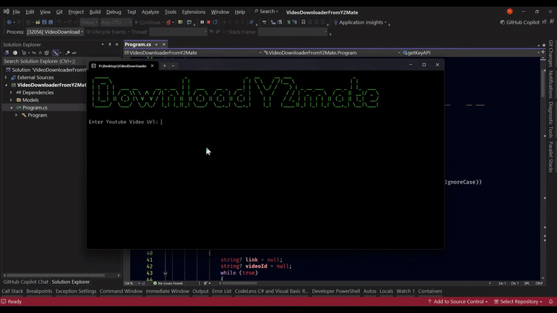

<h1 align="center">
    <br>
        Y2Mate Video Downloader
    <br>
</h1>

<h4 align="center">Using API of 
    <a href="https://y2mate.lol/en159/" target="_blank">Y2MATE</a> to download <span style="color: red;">Youtube Video</span> without ADS.
</h4>

<p align="center">
    <a href="https://learn.microsoft.com/en-us/dotnet/csharp/">
        
    </a>
</p>

<p align="center">
    <a href="#key-features">Key Features</a> •
    <a href="#how-to-use">How To Use</a> •
    <a href="#related">Credits</a>
</p>



## Key Features

-   Download Youtube using <a href="https://y2mate.lol/en159/" target="_blank">Y2MATE</a> API

## How To Use

To clone and run this application, you'll need [C#](https://learn.microsoft.com/en-us/dotnet/csharp/) and [Visual Studio](https://visualstudio.microsoft.com/)

```bash
# Clone this repository
$ git clone https://github.com/VinhTin-AQUA/y2mate-youtube-downloader.git
```

Then open project by Visual Studio and run application

## Credits

This software uses the following open source packages:

-   [C#](https://learn.microsoft.com/en-us/dotnet/csharp/)
-   [Visual Studio](https://visualstudio.microsoft.com/)

